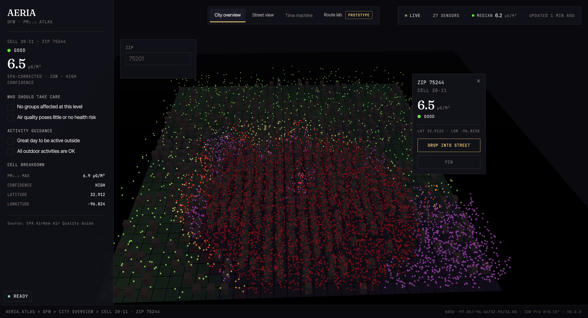

# DFW Air Quality



**Live:** [dfw-airquality.vercel.app](https://dfw-airquality.vercel.app)

A real-time, street-level PM₂.₅ dashboard for the Dallas–Fort Worth metro. Fuses live IoT sensor data, traffic congestion, and wind direction into an interpolated, block-level air quality grid — surfaced through a 3D web dashboard (AERIA) with cell-level drill-down and a first-person street view.

Public air quality tools surface point-sensor readings or county-level averages. Neither captures the spatial variation that matters at a pedestrian or cyclist scale, where proximity to a congested corridor or downwind position from an emitter can shift PM₂.₅ exposure by an order of magnitude over a few hundred meters. This project closes that gap with an interpolated, traffic- and wind-corrected grid resolved to the block level.

---

## What it does

- Pulls live PM₂.₅ readings from 27 PurpleAir sensors across the DFW metro and supplements them with OpenAQ reference monitors
- Applies EPA correction (AirNow Fire and Smoke Map formula) to raw PurpleAir readings using humidity
- Interpolates a smooth 200×200 PM₂.₅ grid using IDW (Inverse Distance Weighting) with cosine-corrected distance calculations for Dallas latitude
- Adjusts the interpolated grid using live TomTom traffic congestion (exponential curve weighting) and OpenWeatherMap wind direction (per-cell cosine similarity factor)
- Renders a stylized 3D city dashboard with cell-level drill-down and a first-person street view, plus a Folium raster overlay map for local cross-comparison
- Accumulates live snapshots for drift monitoring and downstream modeling

---

## AERIA — 3D web dashboard

The custom frontend ([`web/`](web/)) is the primary interface and what's deployed at [dfw-airquality.vercel.app](https://dfw-airquality.vercel.app). Built in React Three Fiber and backed by a FastAPI service ([`api/`](api/)) that wraps the Python engine as typed JSON endpoints. The Folium/Streamlit app (`app.py`, `viz/heatmap.py`) remains available for local cross-comparison.

**Two primary views.** A top-down isometric *city overview* of the DFW bounding box with a clickable cell grid, generated buildings, and PM₂.₅-driven particle ambience — hovering surfaces a cell info card; clicking selects the cell and updates the side panel. A first-person *street view* drops the user into ground level for any selected cell; the geometry is reusable, only the air-quality state changes.

**Persistent left panel.** AQI category, current PM₂.₅ reading with 24h delta and attribution line ("EPA-corrected · IDW from N nearby sensors"), AQI-driven health guidance for sensitive groups and the general public, activity guidance (outdoor exercise, windows, masks), and a per-cell breakdown (traffic adjustment, wind adjustment, highway distance, last updated).

**Top status bar.** Live indicator with sensor count, network-median PM₂.₅ (robust to outlier sensors), wind speed and direction, and an "updated N min ago" timestamp.

**ZIP search.** Jump the camera and selection straight to any DFW ZIP.

---

## Dallas coverage

Bounding box: N 33.08 / S 32.55 / E -96.46 / W -97.05

19 of 27 sensors pass A/B validation on a typical run. 7 of 16 macro grid cells are sparsely covered, clustered in southern and far-eastern DFW (CV=1.21) — these regions are flagged as low-confidence in the dashboard so residents and decision-makers know where the interpolation is well-grounded and where it isn't.

---

## Data sources

| Source | Purpose | Notes |
|---|---|---|
| PurpleAir | Live + historical PM₂.₅ | Primary sensor network, EPA-corrected |
| OpenAQ | Live PM₂.₅ | Reference-grade monitors, secondary source |
| OpenWeatherMap | Live wind speed + direction | Free tier |
| TomTom Traffic | Real-time congestion | 2,500 req/day free tier |
| OpenStreetMap / Overpass | Street geometry | No API key needed |
| Meteostat (NOAA ISD) | Historical wind | Training pipeline only, no key |

All free tier. No credit card required.

---

## Algorithm

**Ingestion.** PurpleAir A/B channel validation filters noisy sensors row-by-row. EPA correction applied at the source: `PM₂.₅ = 0.52 × raw − 0.085 × RH + 5.71`. OpenAQ reference data is not corrected (already calibrated). A `source` column is preserved through the pipeline for auditability.

**Interpolation.** IDW on a 200×200 grid over the Dallas bounding box. Longitude deltas are cosine-corrected for Dallas latitude (~32.78°) to avoid ~19% east-west distortion. Grid cells use the 5 nearest sensors with IDW-weighted averaging to eliminate Voronoi-cell artifacts.

**Adjustments.** Post-IDW, each grid cell gets traffic and wind corrections applied. Traffic uses an exponential curve above a congestion threshold. Wind uses per-cell cosine similarity between the wind vector and the bearing from each sensor — downwind cells get pollution added, upwind cells get it reduced. Sensor readings themselves are never modified; adjustments only apply to interpolated grid cells where IDW has no road or wind context.

**Aggregation.** The headline network statistic shown in the top status bar is the *median* across the 30×30 display cells, not the mean. Median is robust to outlier readings from broken or anomalous sensors and is the defensible statistic for sparse sensor networks with known data quality limitations.

**Rendering.** The interpolated and adjusted grid is exposed as JSON via the FastAPI service. The 3D frontend consumes it directly. The Folium view Gaussian-smooths the same grid into a PNG raster (ImageOverlay) with a sparse 30×30 transparent rectangle grid for click popups subsampled from the full 200×200 grid.

---

## Design decisions

**Why IDW over kriging or pure ML.** A 180-day Random Forest pipeline (68,407 sensor-hours across 19 sensors) was evaluated against the deterministic IDW + adjustment baseline using two approaches: raw PM₂.₅ prediction and IDW-residual correction. Neither outperformed the deterministic baseline on RMSE (2.48 µg/m³ vs 2.91 for the residual model). The system ships with the deterministic path. Training infrastructure and spatial features (highway distance via OSMnx) are retained for future iterations. Full writeup in [`ml/docs/`](ml/docs).

**Why post-IDW adjustment instead of feature-engineered IDW.** Sensor readings already encode local traffic and wind effects at the sensor location. Applying traffic and wind corrections to sensor inputs would double-count those effects. Adjustments are applied only to interpolated grid cells — where IDW has no road or wind context — preserving sensor measurements as ground truth.

**Why a custom 3D dashboard over a heatmap layer.** The Folium map renders a Gaussian-smoothed PNG raster instead of 40,000 DOM rectangles, which is fast but visually flat. The 3D dashboard ("AERIA") presents the same data with spatial context — building scale, AQI as colored particle density, first-person drill-down — that supports interpretation at the block level the system was built to deliver.

**Why FastAPI between the engine and the frontend.** The original Python engine wasn't built for browser consumption. FastAPI wraps the existing pipeline as typed JSON endpoints (`/sensors`, `/grid`, `/cells/{id}`) without modifying the underlying logic, which means the same engine serves both the Streamlit app and the React frontend with no code duplication.

**Why median over mean for the headline statistic.** With a sparse sensor network (27 sensors across the DFW metro) and known data quality issues (8 of 27 sensors typically fail A/B validation; a smaller number return anomalous values that survive validation but still skew aggregates), median is robust to outliers in a way mean is not. A pure mean is sensitive to a single broken sensor; median requires a much larger fraction of the network to be wrong before it shifts.

---

## See it live

[dfw-airquality.vercel.app](https://dfw-airquality.vercel.app) — Vercel-hosted frontend, Render-hosted FastAPI backend, with a background scheduler keeping the cache warm.

---

## Run locally

```bash
git clone https://github.com/aarushm-cloud/dfw-airquality.git
cd dfw-airquality

python -m venv venv
source venv/bin/activate       # Windows: venv\Scripts\activate
pip install -r requirements.txt
```

Create a `.env` file in the project root (never commit this):

```
PURPLEAIR_API_KEY=your_key_here
OPENAQ_API_KEY=your_key_here
OPENWEATHERMAP_API_KEY=your_key_here
TOMTOM_API_KEY=your_key_here
```

Run the AERIA dev stack (FastAPI backend on `:8000` and Vite frontend on `:5173`):

```bash
./dev.sh --with-frontend
```

Output from each process is prefixed (`[api]`, `[web]`) so the multiplexed log stays scannable. Ctrl+C cleans up every child process.

The Folium/Streamlit app remains available for local cross-comparison:

```bash
./dev.sh --with-streamlit                   # backend + Streamlit only
./dev.sh --with-streamlit --with-frontend   # all three at once
streamlit run app.py                        # standalone Streamlit
```

The frontend lives in [`web/`](web/) — see `web/README.md` for setup.

---

## Background collector

```bash
python scripts/collector.py               # polls every 30 minutes (default)
python scripts/collector.py --interval 15 # polls every 15 minutes
```

Writes to `data/dashboard_snapshots.csv`. Independent of the ML training set.

---

## Architecture

```
dfw-airquality/
├── app.py                  # Streamlit entry point (local cross-comparison)
├── .env                    # API keys (gitignored — never commit)
├── .gitignore
├── requirements.txt
├── config.py               # Constants: bounding box, grid, IDW, traffic/wind params
├── render.yaml             # Render deployment config (backend)
├── runtime.txt             # Python runtime pin
├── api/                              # FastAPI backend wrapping engine/, data/, config.py
│   ├── main.py
│   ├── routes/
│   │   ├── health.py                 # /health — backend liveness
│   │   ├── sensors.py                # /sensors — live PurpleAir + OpenAQ readings
│   │   ├── grid.py                   # /grid — interpolated 200×200 PM₂.₅ grid
│   │   └── cells.py                  # /cells/{id} — per-cell breakdown + attribution
│   └── schemas/                      # Pydantic response models
├── web/                              # Vite + React + TypeScript + R3F frontend (AERIA)
│   ├── src/
│   │   ├── App.tsx
│   │   ├── api/client.ts             # Typed fetch layer for FastAPI
│   │   ├── state/                    # Zustand stores (sensors, grid, scene, view, connection)
│   │   ├── world/                    # Pure helpers: AQI, bbox math, building generation, health guidance
│   │   └── components/
│   │       ├── scene/                # R3F: CityScene, StreetScene, CellGrid, Buildings, Particles
│   │       └── ui/                   # TopNav, TopStatusBar, LeftPanel, CellInfoCard, ZipSearch
│   └── docs/                         # Reference screenshots and design notes
├── engine/
│   ├── adjustments.py      # Shared traffic/wind math (scalar + vectorised)
│   ├── interpolation.py    # IDW interpolation + post-IDW grid adjustments
│   ├── features.py         # Per-sensor live feature columns
│   └── router.py           # Cleanest-route optimizer (scaffolded — UI integration pending)
├── data/
│   ├── ingestion/                   # Live API fetchers
│   │   ├── purpleair.py             # PurpleAir live ingestion (EPA-corrected)
│   │   ├── openaq.py                # OpenAQ v3 ingestion (secondary PM₂.₅ source)
│   │   ├── weather.py               # OpenWeatherMap ingestion (live wind)
│   │   ├── traffic.py               # TomTom ingestion (live congestion grid)
│   │   └── history.py               # Live dashboard snapshot accumulator
│   ├── spatial/
│   │   └── spatial_features.py      # OSMnx highway-distance feature builder
│   ├── dashboard_snapshots.csv      # Accumulated live snapshots
│   └── .cache/                      # OSMnx + other cached fetches
├── ml/
│   ├── predictor.py                 # Random Forest inference (evaluated, not in live path)
│   ├── training/
│   │   └── collect_training_data.py # Canonical training-data builder
│   ├── analysis/
│   │   ├── sensor_coverage_check.py
│   │   ├── openaq_coverage_check.py
│   │   └── output/                  # Generated PNGs / CSVs
│   ├── models/                      # .pkl files (gitignored)
│   ├── data/                        # ML-specific data artifacts
│   │   ├── history.csv              # Training set (gitignored)
│   │   ├── quality_report.json
│   │   ├── collection_log.txt
│   │   └── .checkpoints/            # Per-sensor parquet resume points
│   └── docs/                        # Algorithm + negative-result documentation
├── scripts/
│   └── collector.py        # Headless live snapshot collector
├── viz/
│   └── heatmap.py          # Folium map: raster overlay, sensor dots, popups, legend
└── tests/                  # Backend and engine tests
```

---

## Roadmap

- **Cleanest-path route optimizer** — graph routing on the OSM street network, with edge weights combining distance and PM₂.₅ exposure. Backend (`engine/router.py`) is scaffolded; UI integration pending.
- **Historical playback** — time-machine view over the accumulated `dashboard_snapshots.csv`, scrubbing through past PM₂.₅ states.
- **Random Forest residual model in inference** — *evaluated, baseline outperformed, shelved.* The 180-day RF pipeline didn't beat deterministic IDW + adjustments on RMSE (see [`ml/docs/PHASE4_RESULT.md`](ml/docs/PHASE4_RESULT.md) for the full negative-result writeup). Training infrastructure and the OSMnx-backed spatial feature pipeline are retained, but the live dashboard runs on IDW.

---

## Tech stack

Python 3.10+ engine with a FastAPI service layer; React + React Three Fiber frontend bundled with Vite. A few distinctive choices:

- **FastAPI** — typed JSON wrapper around the existing Python engine; same backend serves Streamlit and the React frontend with no logic duplication
- **React Three Fiber** — declarative 3D scene graph for the city and street views
- **Zustand** — minimal frontend state for sensors, grid, scene, and view selection
- **OSMnx** — street graph extraction for the cleanest-path optimizer and highway-distance spatial features
- **Meteostat** — historical NOAA ISD wind data for offline training without an API key

Full dependency list in `requirements.txt` (Python) and `web/package.json` (frontend).
